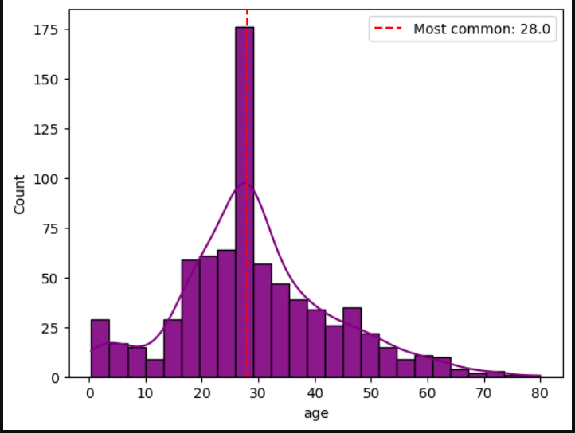
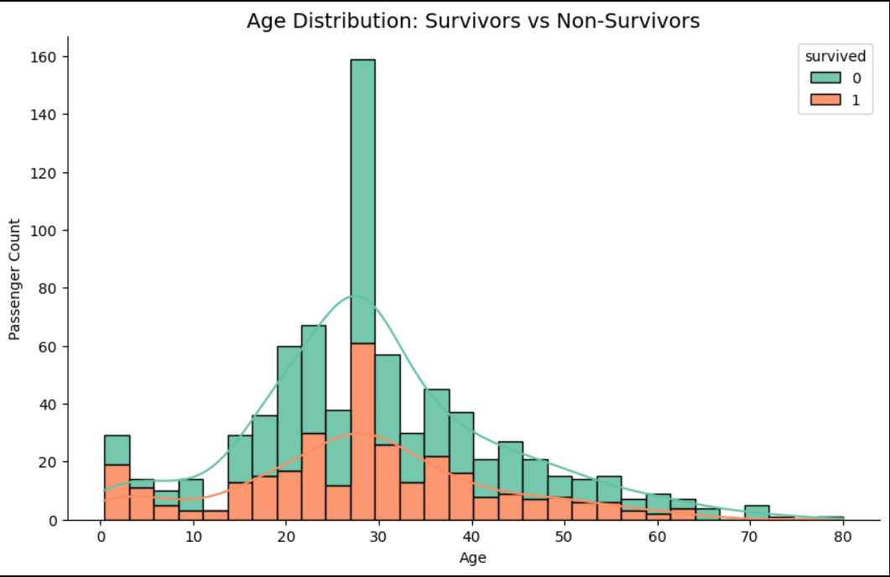
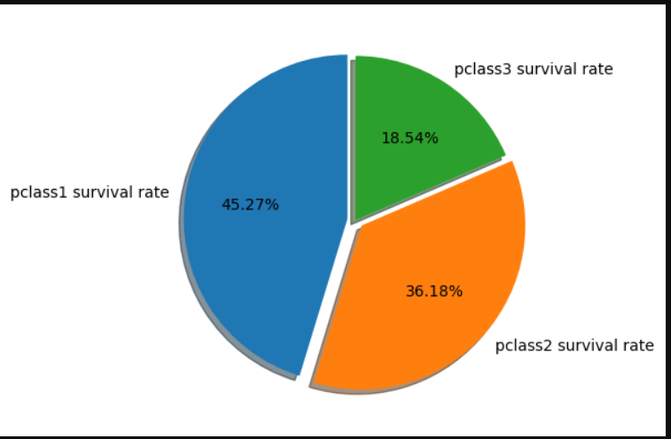
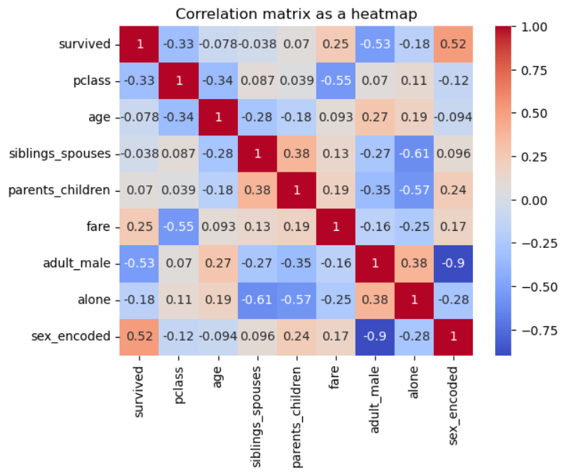
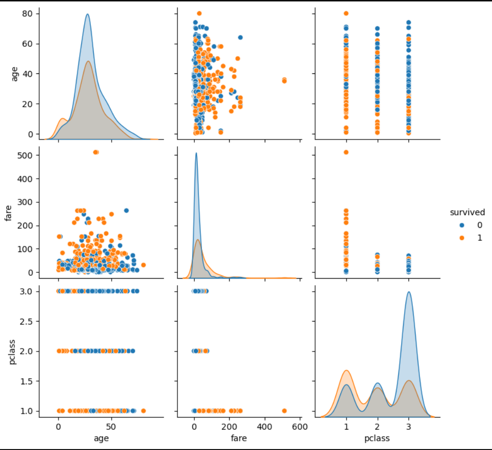
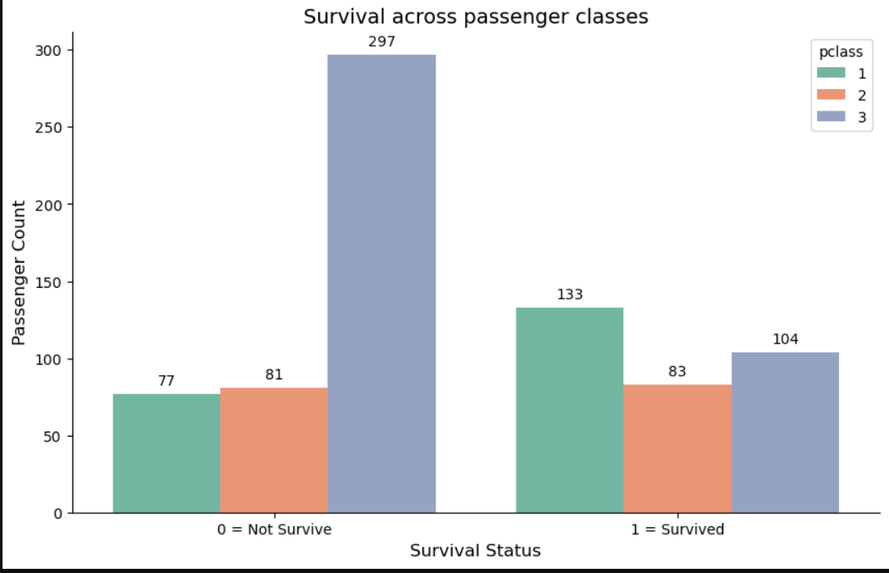
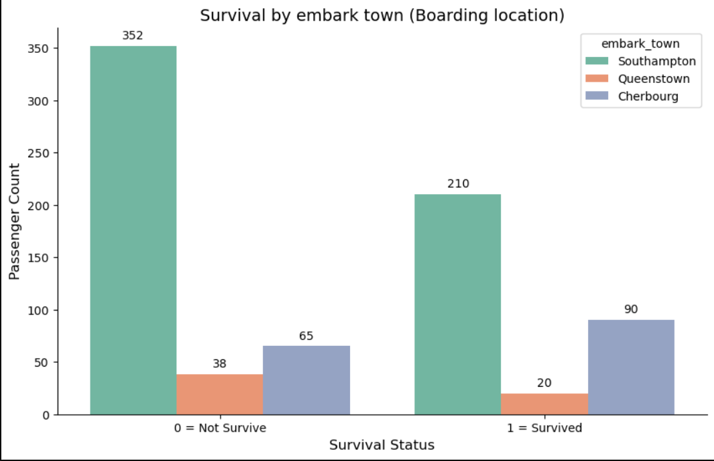
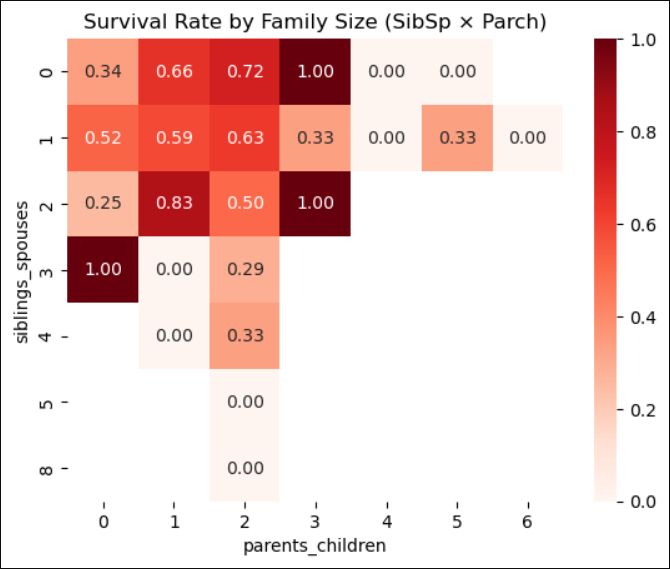
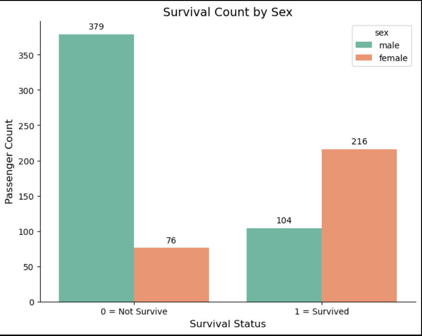
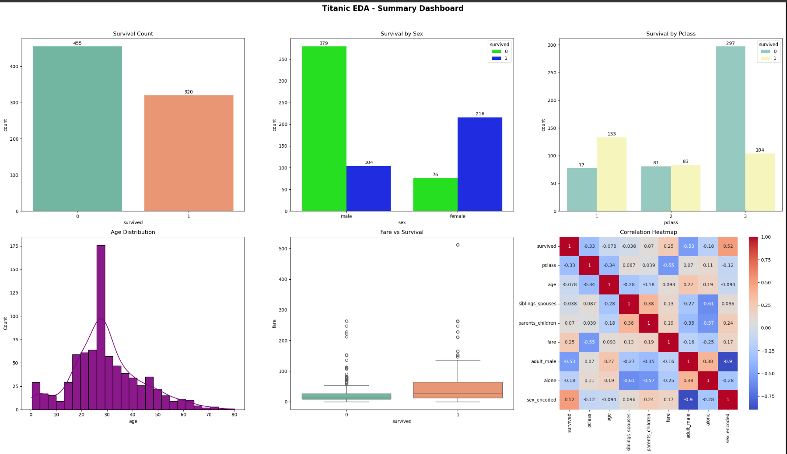

# 🚢 Titanic Dataset — Data Science Internship Project


---

## 📌 Problem Statement

The Titanic disaster of 1912 is one of the most infamous shipwrecks in history.
This project aims to **analyze the Titanic passenger dataset** to uncover patterns
and factors that influenced passenger survival — such as age, sex, passenger class,
fare paid, and boarding location.

The goal is to follow a complete **Data Science workflow**:
- Clean and prepare raw data for analysis
- Explore the data through statistical and visual analysis
- Extract meaningful insights that could later support a predictive model

---

## 📂 Repository Structure

```
synent-task1-Data-Cleaning-Preprocessing-vikas/
│
├── data_cleaning_and_preprocessing.ipynb   # Data Cleaning
├── EDA_titanic.ipynb                       # EDA + Visualization
├── titanic_cleaned.csv                     # Cleaned dataset (output of Data Cleaning)
└── README.md
```

---

## 🗃️ Dataset Details

| Property | Details |
|---|---|
| **Source** | Seaborn built-in dataset — `sns.load_dataset('titanic')` |
| **Total Rows** | 891 passengers |
| **Total Columns** | 15 |
| **Target Variable** | `survived` (0 = No, 1 = Yes) |

> ⚠️ **Note:** The original raw data is loaded directly from Seaborn's built-in datasets
> using `sns.load_dataset('titanic')` — no external CSV download required.

### Columns

| Column | Description |
|---|---|
| `survived` | Survival status (0 = No, 1 = Yes) |
| `pclass` | Passenger class (1 = 1st, 2 = 2nd, 3 = 3rd) |
| `sex` | Gender of the passenger |
| `age` | Age of the passenger |
| `sibsp` | No. of siblings/spouses aboard |
| `parch` | No. of parents/children aboard |
| `fare` | Ticket fare paid |
| `embarked` | Port of embarkation (C / Q / S) |
| `embark_town` | Full name of boarding town |
| `deck` | Deck level (high missing values — dropped) |
| `class` | Text version of pclass |
| `who` | Man / Woman / Child category |
| `adult_male` | Boolean — adult male or not |
| `alive` | Text version of survived |
| `alone` | Boolean — travelling alone or not |

---

## 🔄 Approach

### ✅ Part 1 — Data Cleaning & Preprocessing
**File:** `data_cleaning_and_preprocessing.ipynb`

This notebook handles all raw data preparation steps:

- **Missing Values**
  - `age` → filled with **median** (robust to outliers)
  - `embarked`, `embark_town` → filled with **mode** (most frequent value)
  - `deck` → **dropped** (77%+ missing values — not salvageable)
- **Duplicates** → checked and removed
- **Data Type Conversion**
  - `survived`, `pclass`, `sex` → converted to `category` dtype
  - `age`, `fare` → confirmed as `float64`
- **Column Renaming**
  - `sibsp` → `siblings_spouses`
  - `parch` → `parents_children`
- **Final Validation** → zero nulls, zero duplicates confirmed

> 💾 **Output:** The cleaned dataset is saved as **`titanic_cleaned.csv`** for use in EDA.
> ```python
> # Saving the cleaned dataset as titanic_cleaned.csv for EDA
> df.to_csv('titanic_cleaned.csv', index=False)
> ```

---

### ✅ Part 2 — Exploratory Data Analysis (EDA)
**File:** `EDA_titanic.ipynb`

EDA is performed on the **cleaned dataset (`titanic_cleaned.csv`)** loaded at the start of this notebook.

#### Section 1 — Univariate Analysis
- Survival count & rate
- Passenger class distribution
- Age distribution (histogram + KDE)
- Fare summary & outlier detection (boxplot)

#### Section 2 — Bivariate Analysis
- Survival rate by **Sex**
- Survival rate by **Passenger Class**
- **Age** distribution for survivors vs non-survivors
- **Fare** vs survival (boxplot)
- Survival rate by **Embark Town**

#### Section 3 — Multivariate Analysis
- Survival by **Sex + Pclass** (grouped bar chart)
- Pivot table — average survival by `pclass` × `sex`
- Pairplot — `age`, `fare`, `pclass` colored by survival
- Family size heatmap — `siblings_spouses` × `parents_children`

#### Section 4 — Correlation Analysis
- Correlation matrix of all numerical columns
- Correlation heatmap (`coolwarm`, annotated)
- Impact of `siblings_spouses` and `parents_children` on survival

---

### ✅ Part 3 — Data Visualization
**File:** `EDA_titanic.ipynb`

Visualization is integrated directly into the EDA notebook — every question is answered with a dedicated chart. Charts used:

`Bar Chart` · `Pie Chart` · `Histogram` · `KDE Plot` · `Boxplot` · `Countplot` · `Heatmap` · `Pairplot`

A **Summary Dashboard** (6 plots in one figure) is included at the end:

```python
fig, axes = plt.subplots(2, 3, figsize=(24, 14))
fig.suptitle("Titanic EDA - Summary Dashboard", fontsize=16, fontweight='bold')
```

---

## 📊 Results & Key Insights

| # | Insight |
|---|---|
| 1 | **Female survival rate ~74%** vs Male ~18.9% — females were **3.9x more likely to survive** |
| 2 | **Class 1** had the best survival rate: **63.33%** |
| 3 | **Class 3** had the most passengers: **401** — yet the lowest survival rate |
| 4 | **Cherbourg** boarding passengers had the highest survival rate: **58.06%** |
| 5 | Passengers who paid **higher fares** had significantly better survival chances |
| 6 | The most common age on the Titanic was **28 years** |

---

## 📸 Screenshots 













---

## 🛠️ Tech Stack

| Tool | Purpose |
|---|---|
| `Python 3.x` | Core language |
| `Pandas` | Data manipulation & cleaning |
| `NumPy` | Numerical operations |
| `Seaborn` | Statistical visualization + dataset source |
| `Matplotlib` | Plotting & dashboards |
| `Jupyter Notebook` | Development environment |

---


> ⚠️ **Important:** Always run `data_cleaning_and_preprocessing.ipynb` **before**
> `EDA_titanic.ipynb` — the EDA notebook reads from `titanic_cleaned.csv` which
> is generated by the cleaning notebook.

---

## 📈 Project Status

- [x] 1 — Data Cleaning & Preprocessing
- [x] 2 — Exploratory Data Analysis
- [x] 3 — Data Visualization
- [ ] 4 — Modeling *(coming soon)*

---

## 👤 Author

**Vikas** — Gravity Gaming 96  
Data Science Internship Project · 2025
